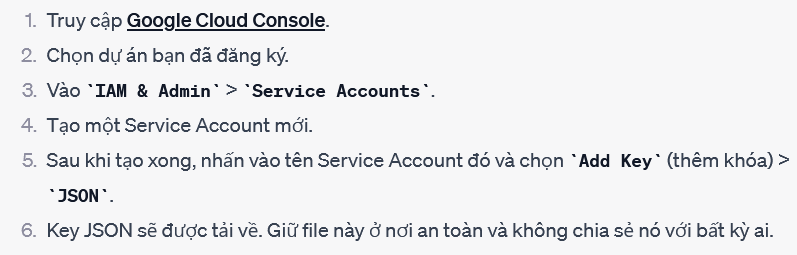

1. Cài đặt thư viện earthengine-api:
$ pip install earthengine-api
2.  Install Google Cloud CLI
3. Xác thưcj tài khoản
$ earthengine authenticate

Khi xác thực xong thì tài khảon google cloud phải được đăng ký earth engine ( phải chờ 1 thời gian nó xác thực :(( hơi lâu )

4. Tạo Service Account và Key 

Nhớ chú ý file json tải về vì nó chứa key

5. Đặt biến môi trường để trỏ đến khóa JSON của bạn:
$ import os
$ os.environ["GOOGLE_APPLICATION_CREDENTIALS"] = "ĐƯỜNG_DẪN_ĐẾN_FILE_JSON_CỦA_BẠN"

Để lấy tên hình ảnh drive làm nhưu sau:
1. Cài đặt 
pip install --upgrade google-api-python-client google-auth-httplib2 google-auth-oauthlib
2. Khi lưu hình ảnh trên drive, nó sẽ lưu tên ảnh trong folder list_name_file
3. Khi download hình ảnh, nó sẽ kiểm tra xem các hình ảnh đó đã tồn tại hay chưa. Nếu chưa thì mới export đến drive.

Khoảng thời gian lấy ảnh.
1. Ngày lấy ảnh cuối cùng sẽ đưcoj lưu trong file date.txt
2. Khi khởi chạy tool thì sẽ lấy từ ngày đó đến ngày hiện tại

